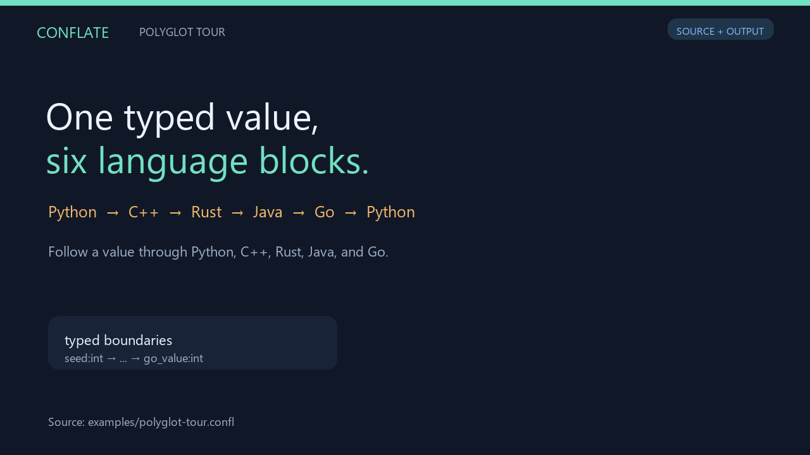

<p align="center">
  
</p>

<h1 align="center">Conflate</h1>

<p align="center">One program. Several languages. Explicit boundaries.</p>

[](https://github.com/Hacker-lot/conflate/actions)

Conflate is an experimental polyglot programming language for composing Python,
C++, Rust, Java, and Go in one `.confl` file. Keep each language's syntax, declare
what crosses a block boundary, and let Conflate generate the value bridges and
native entry points.

Native code is compiled by real toolchains. Conflate's own language layer defines
block order, shared values, typed inputs and outputs, and cross-language calls.
It is useful for small mixed-language tools and experiments; JSON copying and
process boundaries make it a poor fit for tight per-element cross-language loops.



The [polyglot tour](docs/POLYGLOT-TOUR.md) runs all five built-in languages.
The animation is a source walkthrough generated after a verified run.

## Languages and extension paths

| Languages | Integration |
| --- | --- |
| Python, C++, Rust, Java, Go | Built-in value sharing and cross-language function workers |
| JavaScript / Node.js | Recognized registration with value and function sharing |
| PHP | Optional [command-manifest JSON bridge](docs/PHP.md), with value sharing; no cross-language function workers |
| Other runtimes | Command manifests; value sharing requires a bridge for that runtime |

The concept is extensible polyglot programming. Different integrations have
different capabilities; adding a compiler path alone does not supply a bridge.

## Explicit boundaries

```text
@python(out: seed: int)
seed = 40
local_note = "This stays inside the block"

@cpp(in: seed: int; out: answer: int)
int answer = seed.as<int>() + 2;

@python(in: answer: int)
print(answer)  # 42
```

`in` names are required inputs; `out` names are the values a block publishes.
Conflate checks their types at runtime and reports boundary failures at the
source marker. A missing clause means an empty list. Bare `@python` and `@cpp`
markers retain the earlier implicit sharing behavior.

Read the [language specification](docs/LANGUAGE.md), or run
[`typed-pipeline.confl`](examples/typed-pipeline.confl):

```sh
python -m pip install -e .
conflate --doctor
conflate --run-source examples/typed-pipeline.confl
```

## Prepare a local build

```sh
conflate --build examples/typed-pipeline.confl -o build/typed-pipeline
conflate --run-build build/typed-pipeline
```

The build directory contains a source snapshot, manifest, and prepared native
artifacts. Building does not execute your program. These are local builds for
the current environment, not standalone or cross-platform distribution bundles.
Python and Conflate remain required, alongside the native runtimes in use.

## A quick example

```cpp
@python

def fib(n):
    if n <= 1:
        return n
    return fib(n - 1) + fib(n - 2)

@cpp

int n;
std::cin >> n;

@python

print(fib(n))
```

Save that as `fib.confl`, then compile and run it:

```powershell
conflate -c fib.confl
conflate -r fib.exe
```

Enter `10`; Conflate prints `55`.

## Install from source

You need Python 3.11 or newer and a C++20 compiler named `g++` or `clang++`.
Programs using other blocks also need their normal tools: `rustc`, `javac` plus
`java`, or `go`. Put the commands on your `PATH`.

```powershell
git clone https://github.com/Hacker-lot/conflate.git
cd conflate
python -m pip install -e .
```

Then try the included example:

```powershell
cd examples
conflate -c helloWorld.confl
conflate -r helloWorld.exe
```

## What works today

- Python, C++, Rust, Java, and Go blocks execute from top to bottom.
- Strings, numbers, booleans, lists, dictionaries, and `None` cross the boundary.
- Simple native variables can return to later language blocks.
- Functions stay callable across blocks. Native workers keep function state
  until the program exits, and can call back into Python.
- Register another compiler or enable JavaScript by pointing Conflate at Node.js.
- Conflate generates entry points, state plumbing, and build commands.
- Compiled blocks are cached and reused when only input values change.

## What does not

- The generated executable is a launcher, not a standalone binary. It still needs
  Python, Conflate, and a C++ compiler on the machine where it runs.
- Native variable discovery is based on straightforward declarations, not full
  language parsers.
- Automatic integration needs known language conventions. Other tools can run
  through a command manifest; full value and function sharing needs a bridge.

Conflate is version `0.4.0`, and the format may change.

## Call a function across languages

```cpp
@python
def square(n):
    return n * n

@cpp
std::cout << square(12); // 144
```

C++ functions, Java methods, Go functions, Rust functions, and registered
JavaScript functions can return values to Python too. See
[`examples/functions.confl`](examples/functions.confl) for a counter that keeps
its state while the program switches languages. Calls use JSON messages, so a
call across languages costs more than a local function call.

## Add a language

```powershell
conflate --add-language javascript node
conflate --add-language mycpp "C:\Tools\LLVM\bin\clang++.exe"
conflate --list-languages
```

Now `@javascript` and `@mycpp` work in `.confl` files. No Conflate source edits
are needed. Python, g++/clang++, rustc, javac, go, and Node.js are recognized.
For an unfamiliar compiler, a [command manifest](DOCUMENTATION.md#adding-languages)
defines how to build and run its source. A compiler executable alone cannot
describe an arbitrary language's values or function signatures.

## More detail

Read [DOCUMENTATION.md](DOCUMENTATION.md) for the execution model, supported
types, CLI reference, examples, and current limits.

## Examples worth trying

- [`polyglot-tour.confl`](examples/polyglot-tour.confl) passes a typed value
  through Python, C++, Rust, Java, and Go in one source file.
- [`php-roundtrip.confl`](examples/php-roundtrip.confl) uses the optional PHP
  manifest bridge to pass values from Python through PHP and back.

- [`typed-statistics.confl`](examples/typed-statistics.confl) sends Python data
  to a C++ loop and publishes only the mean and count for Python to format.

- [`nested-functions.confl`](examples/nested-functions.confl) sends one function
  call through all five built-in languages and back.
- [`data-pipeline.confl`](examples/data-pipeline.confl) passes a list through Go,
  C++, Rust, and Java helpers before Python checks the result.
- [`persistent-service.confl`](examples/persistent-service.confl) proves that a
  C++ static counter survives calls from Java and Python.
- [`recoverable-errors.confl`](examples/recoverable-errors.confl) catches a Rust
  failure in Python, then calls the same Java and Rust workers again.
- [`registered-javascript.confl`](examples/registered-javascript.confl) adds
  Node.js without editing Conflate, then keeps JavaScript function state.

Bug reports and small, focused pull requests are welcome. Start with
[CONTRIBUTING.md](CONTRIBUTING.md).

## License

Conflate is released under the [MIT License](LICENSE).
